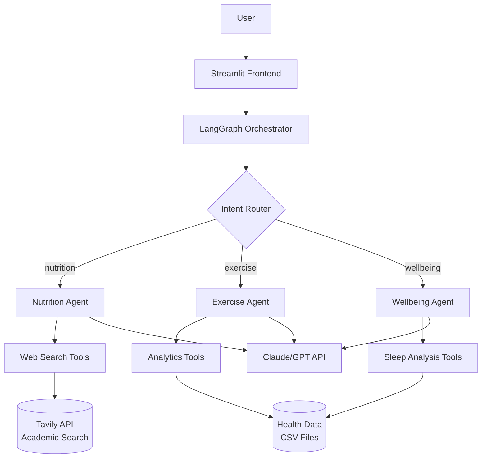

# HealthPilot

**Multi-agent AI health assistant powered by LangGraph and Claude**

Portfolio project demonstrating multi-agent orchestration, web search integration with academic filtering, health data analytics, and full-stack ML engineering.

---

## Overview

HealthPilot is an intelligent health assistant that combines:
- **Multi-agent architecture** using LangGraph to coordinate specialized agents
- **Academic web search** with Tavily API filtering for USDA, NIH, PubMed, and peer-reviewed sources
- **Health analytics** with interactive dashboards analyzing wearable device data
- **Modern ML stack** (Claude/GPT APIs, Tavily, LangChain, Streamlit)

Built as a portfolio project for roles in healthtech/biotech R&D.

---

## Features

### 🤖 Multi-Agent Chat Interface
- **Nutrition Agent**: Evidence-based dietary advice backed by real-time web search of USDA, NIH, and PubMed
- **Exercise Agent**: Workout planning and activity analysis using wearable health data
- **Wellbeing Agent**: Sleep analysis and schedule management guidance
- **Academic Source Citations**: Automatic source attribution with clickable URLs from credible academic sources
- **Wellness Action Cards**: Add wellness activities to calendar or send email reminders

### 📊 Health Analytics Dashboard
- Interactive visualizations (steps, sleep, heart rate)
- Statistical trend analysis and anomaly detection
- Rule-based health insights with recommendations
- Upload your own health data (CSV format)

### 🍽️ Meal Planning with Shopping Lists
- **AI-powered meal planning** with personalized nutrition targets
- **Science-based recommendations**: BMR/TDEE calculation using Mifflin-St Jeor equation
- **Shopping list generation**: Auto-aggregates ingredients by category (Produce, Proteins, Dairy, etc.)
- Supports multiple dietary preferences (omnivore, vegetarian, vegan, pescatarian)
- Handles allergies and dietary restrictions
- Export meal plans (JSON, CSV, Markdown) and shopping lists (Markdown with checkboxes)
- Detailed macros, ingredients, and prep times for each meal

### 💪 Workout Planning with Calendar Integration
- **AI-powered workout plan generation** following exercise science principles
- **Progressive overload**: Multi-week plans with appropriate volume and intensity
- **Personalized for fitness level**: Beginner, intermediate, advanced
- **Goal-specific programming**: Strength, hypertrophy, endurance, weight loss, flexibility
- **Equipment-aware**: Generates plans based on available equipment (bodyweight, dumbbells, barbell, etc.)
- **Exercise library**: Form cues, common mistakes, variations for safe execution
- **Calendar sync**: Bulk schedule workouts to Google Calendar with timezone support
- **Export formats**: JSON, CSV, Markdown, iCalendar (.ics)

### 👤 User Profile & Data Management
- **Profile page**: UI for managing personal data (no manual JSON editing!)
  - Basic info: Name, age, sex, height, weight, timezone
  - Fitness settings: Level, goals, equipment, activity level
  - Preferences: Calorie target, sleep goal, dietary restrictions
- **Data upload page**: Upload your own health data through the UI
  - Activity data (steps, distance, calories, active minutes)
  - Heart rate data (timestamp, BPM)
  - Sleep data (bedtime, wake time, duration, quality)
  - Download CSV templates, validate uploads, preview data

### 📅 Optional Integrations (No Setup Required)
- **Google Calendar**: Add wellness activities to calendar (OAuth2)
- **Email Reminders**: SMTP-based wellness reminders (Gmail, Outlook, etc.)

---

## Architecture



**Key Design Decisions:**
- **Flat LangGraph** for simplicity (3 agents don't need nested graphs)
- **Tavily web search** with academic domain filtering for credible sources
- **Real-time search** instead of static knowledge base (always up-to-date information)
- **LLM-based intent router** for flexible classification
- **Tool-based agent architecture** via LangChain

See [`docs/ARCHITECTURE.md`](docs/ARCHITECTURE.md) for detailed architecture.

---

## Tech Stack

| Component | Technology |
|-----------|-----------|
| **Agent Framework** | LangGraph, LangChain |
| **LLM** | Flexible: Anthropic Claude or OpenAI GPT (via factory pattern) |
| **Web Search** | Tavily API (academic domain filtering) |
| **Data Analysis** | pandas, numpy, scipy |
| **Visualization** | Plotly |
| **Frontend** | Streamlit |
| **Calendar** | Google Calendar API (OAuth2) |
| **Tool Organization** | MCP (Model Context Protocol) servers |
| **Observability** | LangSmith (agent tracing) |
| **Package Manager** | uv (with `pyproject.toml`) |

---

## Quick Start

### Prerequisites
- Python 3.11-3.13
- [uv](https://docs.astral.sh/uv/) package manager
- API keys:
  - **LLM**: [Anthropic Claude API](https://console.anthropic.com/) OR [OpenAI API](https://platform.openai.com/api-keys)
  - **Web Search**: [Tavily API](https://tavily.com) (free tier: 1000 searches/month)
  - (Optional) [LangSmith](https://smith.langchain.com/) for tracing

### Installation

1. **Clone and navigate to the project**:
   ```bash
   cd HealthPilot
   ```

2. **Install dependencies** (uv will auto-download Python 3.12):
   ```bash
   uv sync
   ```

3. **Configure API keys**:
   ```bash
   cp .env.example .env
   # Edit .env and add your API keys
   ```

4. **Generate sample data** (90 days of synthetic health data):
   ```bash
   uv run python data/generate_sample_data.py
   ```

5. **Run the app**:
   ```bash
   uv run streamlit run streamlit_app.py
   ```

6. **Open in browser**: http://localhost:8501

---

## Project Structure

```
healthpilot/
├── agents/                 # Multi-agent system
│   ├── orchestrator.py     # LangGraph routing
│   ├── nutrition_agent.py  # Web search-powered nutrition expert
│   ├── exercise_agent.py   # Activity data analyst
│   ├── wellbeing_agent.py  # Sleep & schedule advisor
│   └── tools/              # Agent tools (web search, analytics)
├── analytics/              # Health data analysis
│   ├── data_pipeline.py    # CSV loading & validation
│   ├── health_metrics.py   # Statistical computations
│   ├── visualizations.py   # Plotly chart generators
│   └── insights.py         # Rule-based insight engine
├── data/                   # Health data & user profile
│   ├── sample/             # Synthetic CSV data
│   └── user_profile.json   # User preferences
├── pages/                  # Streamlit multi-page app (6 pages)
│   ├── 0_Profile.py        # User profile management UI
│   ├── 1_Chat.py           # AI assistant with citations & wellness cards
│   ├── 2_Dashboard.py      # Health analytics dashboard
│   ├── 3_Meal_Plan.py      # Meal planning with shopping lists
│   ├── 4_Workout_Plan.py   # Workout planning with calendar sync
│   └── 5_Data_Management.py # Upload activity/HR/sleep CSV data
├── meal_planning/          # Meal plan generation & export
│   ├── generator.py        # AI-powered meal plan generation
│   ├── exporter.py         # Export to JSON, CSV, Markdown
│   └── shopping_list.py    # Grocery list generation with categorization
├── workout_planning/       # Workout plan generation & export
│   ├── generator.py        # AI-powered workout plan generation (LLM + exercise science)
│   ├── exporter.py         # Export to JSON, CSV, Markdown, iCalendar
│   ├── exercise_library.py # Exercise reference database (form cues, variations)
│   └── calendar_integration.py # Timezone-aware Google Calendar bulk scheduling
├── streamlit_app.py        # Main app entry point
├── config.py               # Centralized configuration
└── pyproject.toml          # uv dependencies
```

---

## Usage Examples

### 1. Chat with Academic Source Citations
Navigate to **Chat** page and ask:
- *"What are high protein vegetarian foods?"* → Real-time search of USDA database with source URLs
- *"What does research say about Mediterranean diet?"* → PubMed research with clickable citations
- *"I'm feeling stressed, what should I do?"* → Get wellness suggestions with calendar/email buttons
- *"Analyze my activity for the past week"* → Exercise agent computes trends
- *"How is my sleep quality?"* → Wellbeing agent analyzes sleep patterns

### 2. Generate Meal Plans with Shopping Lists
Navigate to **Meal Planner** page:
1. Configure dietary preferences and restrictions
2. Click "Generate Meal Plan"
3. View full meal plan in **Meal Plan** tab
4. See organized grocery list in **Shopping List** tab (auto-categorized by Produce, Proteins, Dairy, etc.)
5. Export both meal plan and shopping list from **Downloads** tab

### 3. View Analytics Dashboard
The **Dashboard** page shows:
- Daily steps timeline with 7-day rolling average
- Sleep duration and stage breakdown
- Heart rate circadian rhythm
- Automated insights ("Your activity is improving", etc.)
- Upload your own health data (CSV format)

---

## Development

### Run Tests
```bash
uv run pytest
```

### Code Quality
```bash
# Format with ruff
uv run ruff check . --fix

# Type checking
uv run mypy agents analytics
```

### View Agent Traces
If LangSmith is configured, view execution traces at:
https://smith.langchain.com/

---

## Deployment

See [`docs/DEPLOYMENT.md`](docs/DEPLOYMENT.md) for:
- Local setup (detailed)
- Streamlit Cloud deployment
- Docker containerization
- Environment variables reference

---

## Documentation

- **[ARCHITECTURE.md](docs/ARCHITECTURE.md)** - System design, data flow, LangGraph structure
- **[DEPLOYMENT.md](docs/DEPLOYMENT.md)** - Setup and deployment guide
- **[AGENTS.md](docs/AGENTS.md)** - Agent design, tools, prompts
- **[DATA_GUIDE.md](docs/DATA_GUIDE.md)** - Data formats, Google Fit export instructions

---

## Roadmap

**Current features:**
- ✅ Multi-agent chat with intelligent routing
- ✅ Academic source citations with URLs from credible sources (NIH, CDC, PubMed, USDA, .edu)
- ✅ Real-time web search with Tavily academic filtering
- ✅ Wellness action cards (calendar/email integration)
- ✅ Health data analytics dashboard with data upload
- ✅ Meal plan generation with personalized nutrition targets
- ✅ Shopping list generation with category organization
- ✅ Google Calendar integration (optional, OAuth2)
- ✅ Email reminders (optional, SMTP)
- ✅ LangSmith observability

**Future enhancements:**
- 🔲 PDF report generation
- 🔲 User authentication and data persistence
- 🔲 Mobile-responsive UI improvements
- 🔲 Integration with fitness trackers (Apple Health, Google Fit, Fitbit)
- 🔲 Personalized goal tracking and progress monitoring

---

## License

MIT License

---

## Acknowledgments

- **Tavily** for academic web search API
- **Anthropic** for Claude API
- **OpenAI** for GPT API
- **LangChain** and **LangGraph** for agent frameworks
- **Streamlit** for rapid UI development
